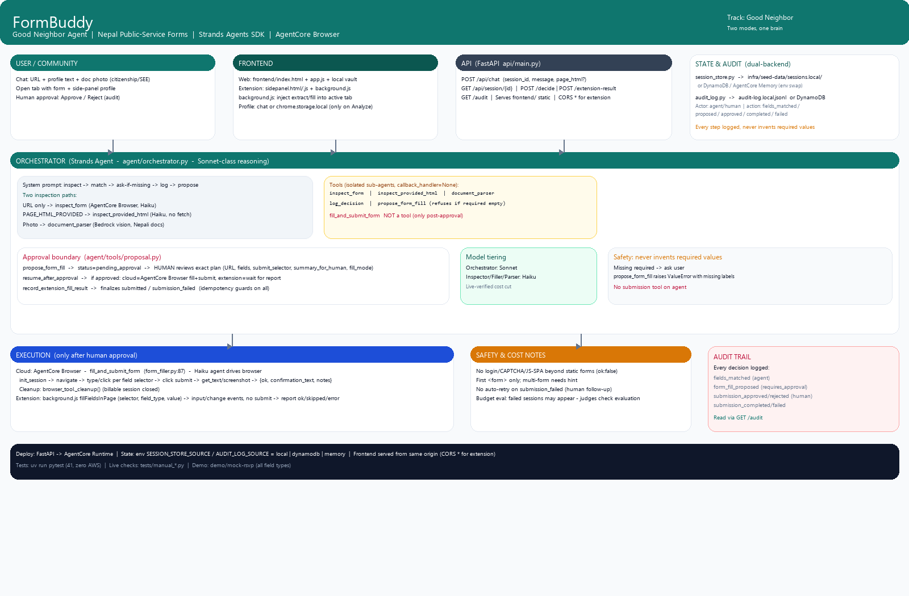

# FormBuddy — Good Neighbor Agent for Nepal Public Service Forms

> An agent that helps communities fill public-service forms — scholarships, ward residency, local-level registrations — and only ever submits after you explicitly approve the exact plan.

**Track: Good Neighbor Agents** · Built for the [AWS Agents for Humans Hackathon](https://agentsforhumans.devpost.com/) with the [Strands Agents SDK](https://strandsagents.com/).

[](LICENSE)
[](pyproject.toml)
[](tests/)

## The problem — who it's for, why it matters

In Nepal, a single student like **Maya (20, Hetauda, 6th-semester B.Sc. CSIT)** fills the same personal details into 10–15 forms a year: ward residency letters, campus scholarships, exam registrations, community event RSVPs. Each form asks for the same name, citizenship, ward number, school — but in slightly different wording, on different sites, often with a photo of a citizenship certificate or SEE marksheet as the source of truth. A local cooperative helping 30 families faces this ×30. It's repetitive, error-prone, and when a required field is guessed, applications get rejected.

Existing autofill (browser/1Password) blindly pastes and submits. FormBuddy does the opposite: **it reads the real form live, matches it against what you actually provided (including photos of documents), drafts an exact fill plan, refuses to invent missing required values, and waits for your tap to proceed.** Nothing is ever submitted without your explicit approval — the agent is autonomous until a consequential decision, then it stops.

**Impact:** ~4 min per form → ~45 sec + approval. For a cooperative processing 30 ward letters, that's ~2 hours saved per batch, with fewer rejections and a full audit trail for accountability. (Cost-conscious: local-first dev + Haiku tiering + ephemeral AgentCore deploy — see `COST.md`, stays under $20 of $181 credits.)

## What it does

*   **Reads any form you point it at** — no pre-built map. Either:
    *   **Cloud mode:** give it a URL → it drives a managed **AgentCore Browser** to discover fields (`agent/tools/form_inspector.py:130`)
    *   **Extension mode:** click on your open tab → a content script reads your tab's HTML (`extension/background.js:18`) and sends it for inspection (`agent/tools/form_inspector.py:168`)
*   **Understands you:** matches field labels to chat-provided details, or extracts from a **photo of a Nepali document** (citizenship, SEE marksheet, caste/income certificate, residency letter) via Bedrock vision (`agent/tools/document_parser.py:104`)
*   **Never invents:** if a required field has no real value, it asks you. `propose_form_fill` itself refuses to save an incomplete plan (`agent/tools/proposal.py:89`)
*   **Human approval boundary:** `propose_form_fill` → `pending_approval` → you review the exact plan (URL, every field label/selector/value, submit selector, summary) → `resume_after_approval` (`agent/tools/proposal.py:147`) executes. Cloud fills+submits via AgentCore Browser (`agent/tools/form_filler.py:87`); extension fills your tab only, you click Submit (`extension/background.js:28`)
*   **Auditable:** every decision (agent matched fields, proposed, human approved/rejected, submitted/failed) goes to `agent/tools/audit_log.py:54` (local JSONL or DynamoDB)

## Architecture



> Mermaid source: [`docs/architecture.mmd`](docs/architecture.mmd). Also see [`agent/orchestrator.py`](agent/orchestrator.py) and [`agent/tools/proposal.py`](agent/tools/proposal.py).

Two modes, **one brain** — same orchestrator, same approval gate, same audit trail. Only *how it sees the page* and *who executes the fill* differs.

| | Cloud mode | Chrome extension mode |
|---|---|---|
| You give it | a URL | the tab you already have open |
| Reads via | AgentCore Browser (remote managed browser) | content script reading your own tab |
| On approval | AgentCore Browser fills **and submits** | fills only — **you** click Submit |
| Profile | in chat (or saved locally in web vault) | `chrome.storage.local`, sent only on Analyze |

**Model tiering (cost optimization):** Orchestrator (reasoning/matching) runs on the default model (Sonnet-class); isolated sub-agents for inspection (`form_inspector.py:35`) and filling (`form_filler.py:30`) run on **Haiku** — structured extraction doesn't need frontier reasoning and the browser loop is token-heavy. Live-verified to keep Bedrock costs low.

**State:** `api/main.py:44` FastAPI thin wrapper over `agent/` (no logic duplicated). Session state in `agent/tools/session_store.py:7` — local JSON (`infra/seed-data/sessions.local/`) for demo, DynamoDB / AgentCore Memory for deployed env (drop-in swap).

## Safety model

```
Chat/page → agent inspects form (inspect_form / inspect_provided_html)
    ↓
Missing required field? → agent asks you, never invents a value
    ↓
propose_form_fill (refuses to save an incomplete plan if required empty)
    ↓
HUMAN reviews exact plan and approves/rejects
    ↓
Cloud: AgentCore Browser fills + submits → audit: submission_completed / failed
Extension: your browser fills fields → you review → you click Submit → extension reports → audit
```

See `docs/safety.md` (if present) and audit spec in `agent/tools/audit_log.py`.

## Demo

**Live demo:** `https://<your-agentcore-url>` *(deploy per `docs/deploy.md`)*

**Local demo form (no real submission):** `demo/mock-rsvp/index.html` — a fictional "Kathmandu Tech Meetup RSVP / Ward-style form" hosted via `frontend/` or S3, used for repeatable testing of all field types (text, email, tel, number, select, textarea, checkbox). After submit it shows `confirmation.html` with a synthetic confirmation code.

**Try it:**
1. Cloud: paste `demo/mock-rsvp` URL + "My name is Alex Rai, email alex@example.com, phone 9800000000, 2 guests, vegetarian, L" → review proposal → Approve
2. Extension: open any real form, fill profile once in side panel → Analyze This Page → Authorize & Fill → review and Submit yourself

Screenshots: `screenshots/` (extension sidepanel, filled form, proposal card, generic check)

## Project layout

```
agent/            Orchestrator + tools (form inspection, filling, approval, audit, doc parser)
  orchestrator.py  System prompt + tool wiring (Haiku sub-agents, Sonnet orchestrator)
  tools/
    proposal.py        Approval boundary (propose/resume/record_extension)
    form_inspector.py  Cloud vs extension inspection (both Haiku)
    form_filler.py     AgentCore Browser fill+submit (only post-approval)
    document_parser.py Bedrock vision extraction for Nepali docs
    audit_log.py       Dual-backend audit trail
    session_store.py   Dual-backend session store (local JSON / DynamoDB)
api/               FastAPI backend — thin HTTP wrapper around agent/, serves frontend/
frontend/          Web chat UI (cloud mode) + local profile vault
extension/         Chrome extension (Manifest V3) side panel + background service worker
demo/mock-rsvp/    Demo form (text/email/tel/number/select/textarea/checkbox)
tests/             pytest 41 tests, zero AWS dependency + manual live-check scripts
docs/              Architecture diagram, safety notes, deploy guide
infra/             Seed data (audit log, sessions — local demo backend)
```

## Running it

**Prereqs:** Python 3.12, `uv`, AWS credentials with Bedrock model access (Anthropic Claude) if you want live browser/vision. Tests run without AWS.

```bash
uv sync
# Backend (required for both modes) — serves http://localhost:8000
uv run uvicorn api.main:app --reload

# Web UI (cloud mode): open http://localhost:8000
# Chrome extension: chrome://extensions → Developer mode → Load unpacked → select extension/ → Pin icon

# CLI (debug):
uv run python -m agent.orchestrator "I want to RSVP to https://example.com/form. My name is Maya Gurung, email maya@example.com"
uv run python -m agent.orchestrator --resume <session_id> approved
```

**Env vars (optional):**
*   `AUDIT_LOG_SOURCE=local|dynamodb` + `AUDIT_LOG_TABLE_NAME`, `AUDIT_LOG_LOCAL_PATH`
*   `SESSION_STORE_SOURCE=local|dynamodb` + `SESSION_TABLE_NAME`, `SESSION_STORE_LOCAL_DIR`
*   Deploy: see `docs/deploy.md` for AgentCore Runtime + DynamoDB table creation

## Testing

```bash
uv run pytest tests/ -q   # 41 passed, no AWS needed
# Manual live checks (need Bedrock + AgentCore Browser):
# uv run python tests/manual_browser_diagnostic.py
# uv run python tests/manual_form_filler_livecheck.py
# uv run python tests/manual_document_parser_livecheck.py
```

## Roadmap to production (Good Neighbor deployment)

*   [ ] Deploy `api/` to **AgentCore Runtime** (see `docs/deploy.md`) — strengthens Technical Implementation score
*   [x] Dual backends for audit/session already abstracted — swap env var to DynamoDB/AgentCore Memory
*   [ ] Add AgentCore Observability + rate limiting + allow-list origins (currently `*` for extension CORS in `api/main.py:51`)

## License

MIT — see [LICENSE](LICENSE).
